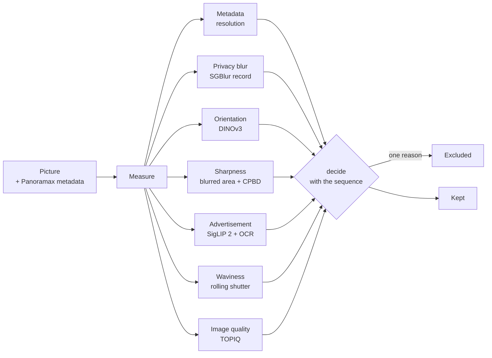

# panomoche

**Automatic sorting of street-level pictures for [Panoramax](https://panoramax.fr):
keep the clean pictures, exclude the unusable ones, and say why.**

Panoramax is the open, federated street-level imagery platform (a free alternative to
Street View). Contributors upload pictures from phones, dashcams, helmet and 360° cameras;
some are blurred, rotated, smeared by a wobbling mount, mostly hidden by privacy blurring,
or not street pictures at all. panomoche measures every picture, compares it with the rest
of its sequence, and sorts it as **kept** or **excluded** with one reason.

It is a working prototype meant to be integrated into Panoramax: it reads pictures from the
Panoramax API, can tag results back as Panoramax *semantics* (dry run by default), and exposes
an HTTP endpoint a Panoramax server could call on upload.

---

## How a picture is judged



Every measurement is taken first, then one function (`panomoche/decision.py`) applies one set
of rules. A picture is **excluded** when one of these applies, otherwise it is **kept**:

| Reason | Rule | Measured by |
|---|---|---|
| `labelled_blurred` | a reviewer marked it Blurred on the review page | `data/user_labels.json` |
| `low_resolution` | fewer than 15 px per degree of view | Panoramax metadata |
| `advertisement` | obvious advertising graphic: layout, text area and commercial wording all agree | SigLIP 2 + Tesseract OCR |
| `privacy_blur` | blurred faces and plates cover more than 5% of the picture | SGBlur's record in the original file |
| `wrong_orientation` | upside down or sideways with ≥ 99% confidence; 360°: 2 of 4 rendered views rotated | DINOv3 + logistic regression |
| `not_sharp` | ≥ 33% of the textured area blurred with CPBD < 0.15, or ≥ 20% with CPBD < 0.12 | OpenCV (detail ratio, edge widths) |
| `wavy` | rolling-shutter wobble, confirmed by ≥ 30% of the sequence neighbours (flat pictures) | Canny edge bending |
| `sequence_outlier` | TOPIQ ≥ 0.12 below the median of its neighbours (±10 pictures) | TOPIQ-NR |
| `low_quality` | TOPIQ < 0.32 (360° or in a sequence), < 0.40 (flat picture judged alone) | TOPIQ-NR |

Principles behind the rules:

* **Exclude only what is really not clean.** Every threshold was set by looking at every
  picture it catches on real Panoramax data; when in doubt, a picture is kept.
* **Judge a picture against its sequence.** Quality scores mostly rank cameras (a dashcam
  behind a windshield is softer than a phone on every picture). Comparing each picture with
  the 10 before and after it finds the pictures that are worse than their own camera's
  normal. A picture judged alone gets the benefit of the doubt.
* **No manual "keep".** Reviewer labels can only exclude; the rules decide everything else.
* **One system everywhere.** `predict`, the upload page and the review page call the same
  `decide`; uploading a picture that is on the review page gives the same verdict.

The architecture (C4 diagrams, API, data) is in [docs/ARCHITECTURE.md](docs/ARCHITECTURE.md);
the reasoning, measurements and rejected alternatives behind every rule are in
[docs/METHODS.md](docs/METHODS.md).

## Results

| Dataset | Pictures | 360° | Cameras | Kept | Excluded |
|---|---:|---:|---:|---:|---|
| `data/all.jsonl`: 4 sequences of 150 + 700 random and Paris pictures | 1,300 | 491 | 102 | 1,158 | 142: 47 not sharp, 46 wavy, 17 low quality, 14 wrong orientation, 10 sequence outliers, 7 privacy blur, 1 low resolution |
| `data/new.jsonl`: random, one per sequence | 493 | 128 | 97 | 477 | 16: 14 not sharp, 2 low quality |
| `data/new2.jsonl`: random, one per sequence | 590 | 135 | 100 | 573 | 17: 13 not sharp, 4 low quality |

The two random datasets were fetched after the rules were tuned and share no picture or
sequence with the first one, so they show how the rules behave on unseen data.

**Blur benchmark** ([reports/blur_benchmark.md](reports/blur_benchmark.md)): 200 unseen
pictures, blurred 6 ways, every method set to the same 3.5% false-alarm rate.

| Blur added | panomoche rule | Laplacian variance | TOPIQ |
|---|---:|---:|---:|
| focus σ 1.5 px / 3 px | 100% / 100% | 100% / 100% | 36% / 95% |
| motion 5 / 11 / 21 px | 56% / 74% / 73% | 36% / 78% / 91% | 28% / 85% / 100% |

The rule takes 23 ms per picture. Motion blur is its weak spot (see *Things to know*).

## Tech stack

| Area | Technology | Used for |
|---|---|---|
| Language | Python 3.12 (≥ 3.10) | everything server-side |
| Image quality | [TOPIQ-NR](https://github.com/chaofengc/IQA-PyTorch) (SPAQ weights) via `pyiqa` 0.1, PyTorch 2 (CPU) | quality score, sequence comparison |
| Vision backbone | [DINOv3](https://github.com/facebookresearch/dinov3) ViT-S/16 via `timm` 1.0 | orientation classifier, blur model experiments |
| Vision-language | [SigLIP 2](https://huggingface.co/google/siglip2-base-patch16-224) base, quantized ONNX, `onnxruntime` 1.30, `tokenizers` | advertisement layout match |
| OCR | Tesseract 5 (English) | advertisement wording |
| Classic vision | OpenCV 5, NumPy 2, Pillow 12 | sharpness (detail ratio, CPBD), waviness (Canny chains), 360° projections |
| Machine learning | scikit-learn 1.9, joblib | orientation classifier (logistic regression), evaluations |
| Web | FastAPI, Uvicorn; plain HTML/CSS/JavaScript (no framework, no CDN) | upload page, review page, HTTP API |
| Data source | Panoramax STAC API (`requests`), HTTP Range reads | sampling, downloads, SGBlur records |
| Quality | pytest (169 tests), httpx, ruff (lint + format), vulture (dead code), Playwright (UI checks) | |

Everything runs locally on CPU; no picture leaves the machine except the downloads from
Panoramax.

## Quickstart

```bash
python3 -m venv .venv
.venv/bin/pip install torch torchvision --index-url https://download.pytorch.org/whl/cpu
.venv/bin/pip install -e ".[iqa,serve,ads,dev]"
sudo apt install tesseract-ocr           # OCR for the advertisement check
source .venv/bin/activate
panomoche ads-setup                       # SigLIP 2 model, ~393 MiB, verified by SHA-256 (once)

# orientation model (once, ~10 min): learns "which way is up" from upright pictures, no labels needed
panomoche fetch --out data/raw            # ~500 pictures across France
python scripts/orientation_eval.py        # trains models/orientation.joblib
```

The TOPIQ and DINOv3 weights download on first use. Without `models/orientation.joblib`
the orientation check is skipped; the other checks still run.

```bash
# get pictures: 500 random ones across France, one per sequence, skipping what you already have
panomoche fetch --random 500 --new-sequences --out data/new

# measure and sort them
panomoche predict data/new --out data/new.jsonl

# or a whole Panoramax sequence, judged against itself
panomoche predict --collection <sequence-uuid> --limit 300 --out seq.jsonl

# browse the results and test your own pictures
panomoche serve --predictions data/new.jsonl        # http://localhost:8000

pytest                                               # 169 tests
```

## Using the web app

`panomoche serve --predictions <file.jsonl>` starts a local server on `127.0.0.1:8000`.

* **`/` (upload page):** drop one picture or a whole sequence. Each picture gets its verdict
  and the reason, its measurements, a per-view breakdown for 360° pictures, the privacy blur
  boxes, and the tags `tag --apply` would write. With 6 or more pictures they are also compared
  as one sequence (in file-name order).
* **`/review` (review page):** every picture of the predictions file, with Kept / Excluded
  filters and one per reason, a per-sequence table, sequence order, and a full-size viewer
  (← → to browse). **Blurred / OK buttons** (or **B** / **O** in the viewer, which also moves to
  the next picture) save your judgement to `data/user_labels.json`; a picture marked Blurred
  is excluded immediately and in every later run.
* **HTTP API:** `POST /predict` (multipart `picture`, optional `sgblur` header from SGBlur),
  `POST /api/sequence`, `POST /api/labels`, `GET /api/info`. This is what a Panoramax backend
  would call on upload, the way it already calls SGBlur for privacy blurring.

## Commands

| Command | What it does |
|---|---|
| `panomoche fetch` | download a sample (`--random N` or `--bbox`); skips known pictures, removes duplicates and near-duplicates |
| `panomoche predict` | measure and sort local pictures, a bbox or a sequence (`--collection`); `--html` writes a static review page |
| `panomoche serve` | upload page, review page and HTTP API |
| `panomoche tag` | write results to Panoramax as semantics tags; **dry run unless `--apply`** |
| `panomoche waviness` / `waviness-ui` | the merged Waviness Check: batch reports with overlays / its own browser UI |
| `panomoche ads` / `ads-ui` / `ads-setup` | the merged Advertisement Check: batch reports / its own UI / model download |

Every command has `--help`. Useful options: `--no-sequence`, `--no-orientation`,
`--no-waviness`, `--no-ads`, `--max-blurred-area`, `--max-privacy-blur`, `--labels`.

## Project layout

```text
panomoche/
  cli.py            `panomoche` command
  decision.py       the single decision: excluded (with a reason) or kept
  sharpness.py      blurred area (detail ratio) + CPBD (edge widths)
  orientation.py    rotation classifier on DINOv3 features; 360° rendered views
  privacy.py        privacy blur share from SGBlur's record (also over HTTP Range)
  metadata.py       resolution and GPS checks from Panoramax metadata
  iqa.py            TOPIQ / MUSIQ / LIQE via pyiqa, per-view scores for 360°
  scoring.py        TOPIQ scorer factory
  sequence.py       per-sequence summaries
  dedupe.py         known-picture skipping, duplicate and near-duplicate removal
  panoramax.py      Panoramax API client, sampling, semantics payloads
  service.py        FastAPI app (upload, review, labels, API)
  report.py         review page rendering (served or static)
  imaging.py        loading, 360° detection, views
  waviness/         merged Waviness Check v0.2 (detector, UI)
  advertising/      merged Advertisement Check v0.4 (SigLIP 2 + OCR classifier, UI, policy)
  backbone.py       DINOv3 feature extractor (orientation, blur and rain experiments)
  web/              upload.html, review.html
scripts/            evaluations and benchmarks (each documents itself; see METHODS)
tests/              pytest suite
examples/           reference pictures of the merged tools (credits in examples/advertising)
docs/ARCHITECTURE.md  synthesis, C4 diagrams (context, containers, components), API, data
docs/METHODS.md     detailed methods, measurements and decisions
docs/merged-tools/  original documentation of the two merged tools
reports/            benchmark reports
data/, models/      downloaded pictures, results and model files (not versioned)
```

## Things to know

**Running it**

* **Memory:** built and tested on a CPU-only machine with 8 GB of RAM (WSL2). The server holds
  TOPIQ, DINOv3 and SigLIP 2 (about 2–3 GB). LIQE (one of the compared models) needs more than
  6 GB on first load; it is not used by default.
* **Speed:** about 1–1.5 s per picture for the full `predict` pipeline on CPU; OCR alone adds
  about 0.5 s.
* **Tesseract version:** the advertisement check was verified with Tesseract 5.5; Ubuntu ships
  5.3, which reads stray `"` characters. A parsing fix makes both work (`advertising/classifier.py`).
* **WSL2:** the server listens on `127.0.0.1`; `http://localhost:8000` normally works from
  Windows, otherwise use `--host 0.0.0.0` (which also exposes it to your network).
* `--bbox` with negative coordinates needs `=`: `--bbox=-1.2,47.1,-1.0,47.3`.

**Panoramax specifics**

* Pictures are already anonymised by SGBlur when downloaded. Its detections are stored as a
  comment at the end of the *original* (hd) file only; panomoche reads them with HTTP Range
  requests. The IGN instance does not support Range: use `--privacy-full-download`.
* The "sd" asset is always 2048 px wide, so small originals arrive enlarged; sharpness is
  measured at the original size (from the sensor metadata) to avoid calling them blurred.
* **Nothing is written to Panoramax** unless `panomoche tag --apply` is run with a token.

**Known limits**

* **Motion blur:** the rule catches 73% of strong motion blur (focus blur: 100%). Smear that
  keeps detail across the motion direction (handlebar and helmet mounts, the LG 360° camera)
  often measures as sharp. Reviewer labels cover these for now; a DINOv3 model trained on them
  catches 19 of 24 unseen handlebar pictures but does not yet generalise to other cameras
  (`scripts/blur_model_eval.py`). More varied labels are the way forward.
* **Rain on the lens:** drops are local soft patches with a sharp scene around them, so the
  blur rule passes these pictures. A DINOv3 classifier recognises them (30/30 rainy frames of an
  unseen sequence, 0/30 clean pictures flagged, `scripts/rain_model_eval.py`), but it has only
  seen two rainy sequences from one day and one camera. It is not part of the decision yet; see
  "Rain on the lens" in METHODS.
* **Uniform sequences:** when a whole sequence has the same fault (shot through a side window,
  an obstruction in the corner), no picture stands out from its neighbours.
* **Waviness** is only judged on flat pictures and only when the sequence confirms it: a
  wide-angle lens, a curved building or tree trunks bend single pictures' lines too.
* **Orientation** catches rotations of 90° and more, not a slightly tilted horizon.
* The thresholds were tuned on French Panoramax pictures, checked by eye; they are not a
  calibrated accuracy on a labelled benchmark.

**Merged tools**

* `waviness/` and `advertising/` come from two standalone tools (delivered as zip archives).
  Their code is kept close to upstream so a new release can be merged again; their own tests
  run in the suite (`tests/test_waviness_tool.py`, `tests/test_advertising_tool.py`). Changes
  made on merge: package imports, model location (`models/siglip2`), no global Pillow size
  limit, and the Tesseract parsing fix. Their original READMEs and validation records are in
  [docs/merged-tools/](docs/merged-tools/README.md).

## Development

```bash
pytest                       # 169 tests, ~1 min (the advertisement tests need the model and Tesseract)
ruff check && ruff format --check
vulture panomoche scripts --min-confidence 60   # dead code (FastAPI routes are expected hits)
python scripts/blur_benchmark.py --n 200     # blur benchmark, ~20 min
```

## Licences

* TOPIQ, MUSIQ and LIQE weights are downloaded by pyiqa; check their licences before redistribution.
* DINOv3 weights are under the [DINOv3 License](https://ai.meta.com/resources/models-and-libraries/dinov3-license/).
* SigLIP 2 is Apache 2.0; sources and licences of the example pictures are in
  `examples/advertising/CREDITS.md`.
* Pictures downloaded from Panoramax keep their licence (mostly CC-BY-SA-4.0 or etalab-2.0,
  recorded in each `meta.jsonl`); credit the authors if you redistribute them.
