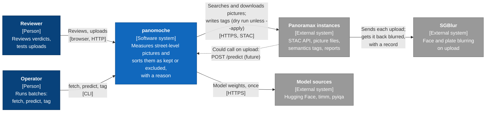
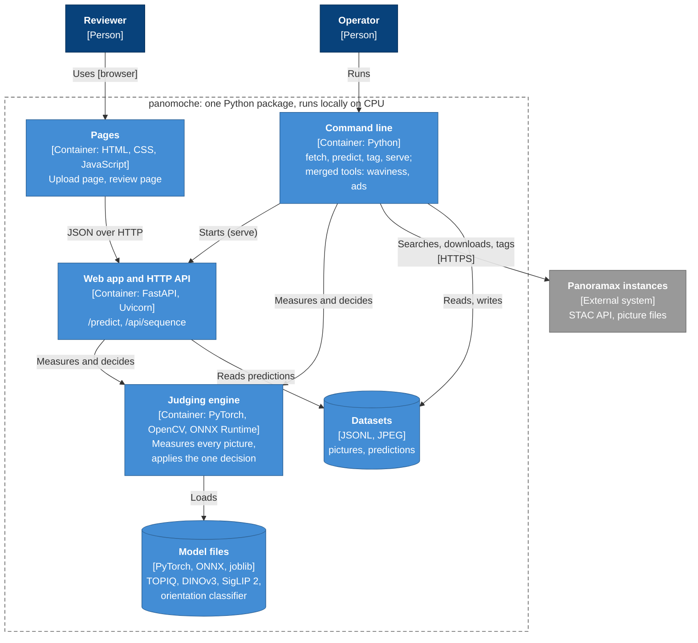
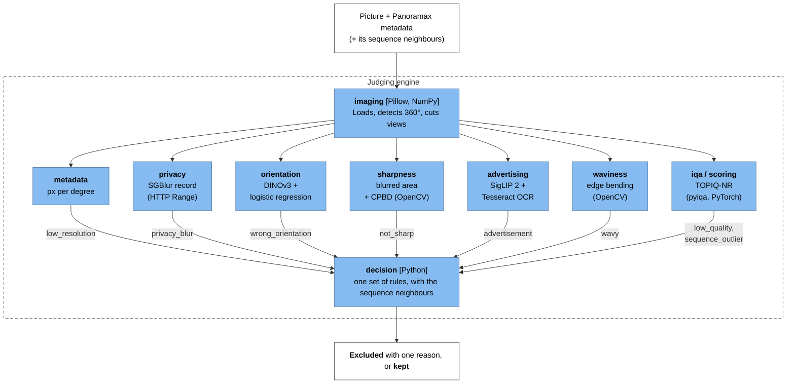
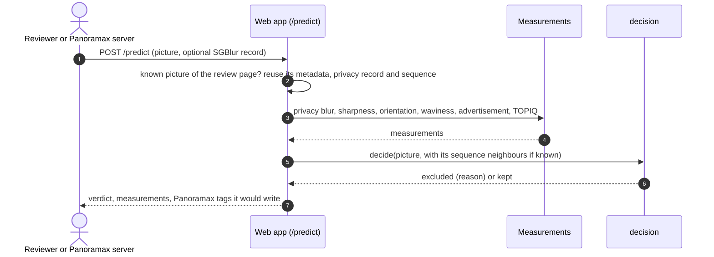

# panomoche: architecture

A synthesis of the system, its API and its parts, with C4 diagrams (context, containers,
components) drawn as Mermaid flowcharts with the C4 notation and colours: they render on
GitHub and stay editable next to the code. How each rule was chosen is in
[METHODS.md](METHODS.md); how to run it is in the [README](../README.md).

## In one paragraph

panomoche sorts street-level pictures for Panoramax as **kept** or **excluded**, with one
reason. It reads pictures and their metadata from Panoramax instances, measures each picture
(metadata, privacy blur, orientation, sharpness, advertisement, waviness, image quality),
and applies one decision that judges each picture against its own sequence. It runs as a
command-line tool for batches and as a local web app with an HTTP API, which a Panoramax
server could call on upload, the way it already calls SGBlur to blur faces and plates.
Everything runs on CPU, locally; nothing is written to Panoramax unless asked explicitly.

## Level 1: system context

## Level 2: containers

## Level 3: components of the judging engine

Supporting modules: `panoramax.py` (API client, sampling, semantics payloads), `dedupe.py`
(known pictures, duplicates), `report.py` (review page rendering), `sequence.py`
(per-sequence summaries), `backbone.py` (DINOv3 feature extractor).

## How one upload is judged

## Decision rules

A picture is excluded, with the first reason that applies; otherwise it is kept.

| Reason | Rule |
|---|---|
| `low_resolution` | under 15 px per degree |
| `advertisement` | layout, text area and commercial wording all point to an advertising graphic |
| `privacy_blur` | SGBlur's blurred boxes cover more than 5% of the picture |
| `wrong_orientation` | rotated with ≥ 99% confidence; 360°: 2 of 4 rendered views |
| `not_sharp` | ≥ 33% of the textured area blurred with CPBD < 0.15, or ≥ 20% with CPBD < 0.12 |
| `wavy` | rolling-shutter wobble confirmed by ≥ 30% of the sequence neighbours (flat pictures) |
| `sequence_outlier` | TOPIQ ≥ 0.12 below the median of the 10 pictures before and after |
| `low_quality` | TOPIQ < 0.32 (360° or with neighbours), < 0.40 (flat picture alone) |

## HTTP API

Served by `panomoche serve` on `127.0.0.1:8000`.

| Method and path | Input | Output |
|---|---|---|
| `GET /` | | upload page |
| `GET /review` | | review page of the predictions file (`--predictions`) |
| `GET /images/{id}?size=thumb\|full` | picture id from the predictions file | JPEG |
| `GET /api/info` | | model, thresholds, which checks are on, number of predictions |
| `POST /predict` | multipart `picture`; optional `is_pano`, `sgblur` (SGBlur's `x-sgblur` header), `tag_key` | verdict (`excluded` reason or null), every measurement, Panoramax semantics tags |
| `POST /api/sequence` | JSON `{"pictures": [measured pictures, in order]}` | each picture re-decided as one sequence |

The merged tools keep their own small servers (`panomoche waviness-ui`, `panomoche ads-ui`) with
`POST /api/analyze`, `POST /api/export` and `GET /api/health`.

## Panoramax interface

| Call | Use |
|---|---|
| `GET /api/search` (STAC, bbox, datetime) | sampling, finding neighbours |
| `GET /api/collections/{id}/items` | a whole sequence, in capture order |
| picture assets (`sd`, `hd`) | `sd` (2048 px) for measuring; the end of `hd` (HTTP Range) for SGBlur's record |
| `PATCH /api/collections/{cid}/items/{id}` (`semantics`) | `panomoche tag --apply`: tags such as `quality_issue=sequence_outlier` with `detection_model[...]` |
| `POST /api/reports` | `tag --apply --report`: `picture_low_quality` moderation reports |

## Data

| File | Content |
|---|---|
| `data/<set>/` + `meta.jsonl` | downloaded pictures and their Panoramax metadata (`fetch`) |
| `data/<set>.jsonl` | one prediction per picture: measurements, `excluded`, `context` (`predict`) |
| `models/` | `orientation.joblib`, `siglip2/` (TOPIQ and DINOv3 weights are cached by pyiqa and timm) |

## Quality and limits

* 169 tests (pytest); lint and format with ruff; dead code checked with vulture.
* Benchmarks: blur detection catches 100% of visible focus blur and 56-74% of motion blur at a
  3.5% false-alarm rate ([reports/blur_benchmark.md](../reports/blur_benchmark.md)).
* Known limits: motion smear, rain on the lens (prototype only), sequences with a uniform fault,
  small horizon tilts. See the README, "Things to know".
